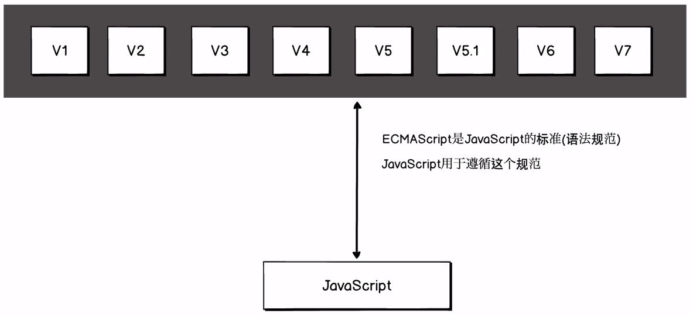
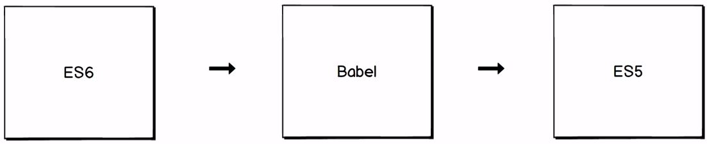
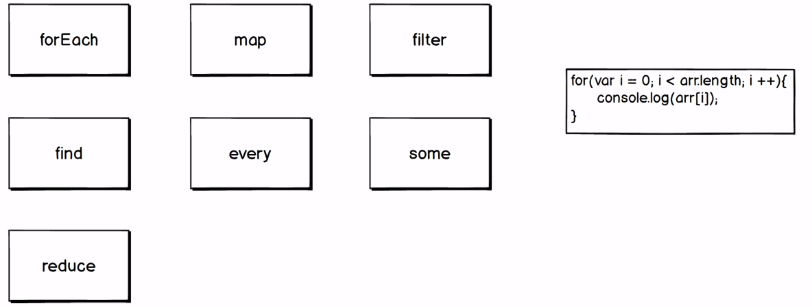
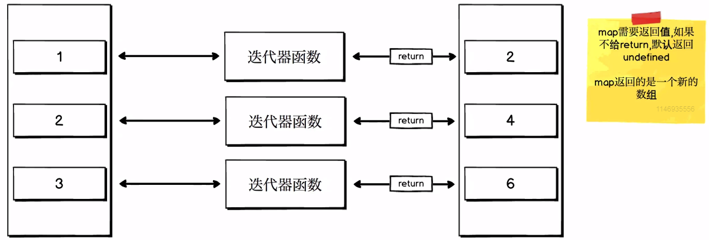

兼容各个浏览器的解决方案

## 数组方法



`var colors = ['red','blue','black','green','skyblue']`

**ES5 遍历数组方法**
 ```javascipt  
 for(var i=0;i<colors.length;i++){
     console.log(colors[i])
}
```  

**ES6 forEach**
```javascript
colors.forEach(function(color){
    console.log(color)
})
```  

**练习： 遍历数组中的值，并计算总和**
```javascript
var numbers = [1,2,3,4,5]

sum = 0;

function adder(number){ sum += number };
numbers.forEach(adder);

console.log(sum)
```  

**假定有一个数值数组(A),将A数组中的值以双倍的形式放到B数组**  

```javascript
var numbers = [1,2,3];

var doubledNumbers = [];

// Es 5
for(var i=0;i<numbers.length;i++){
    doubledNumbers.push(numbers[i]*2)
}

console.log(doubledNumbers)


// Es 6
var doubled = numbers.map(function(number){
    return number*2
})

console.log(doubled)

doubled.forEach(function(number){
    console.log(number)
})
```


**假定有一个对象数组(A),将A数中对象某个属性的值存储到B数组中**  
```javascript
var cars = [
    {model:'Buick',price:'CHEAP'},
    {model:'BMW',price:'expensive'}
]

var prices = cars.map(function(car){
    // return car['price'];
    return car.price;
})

console.log(prices)
```

